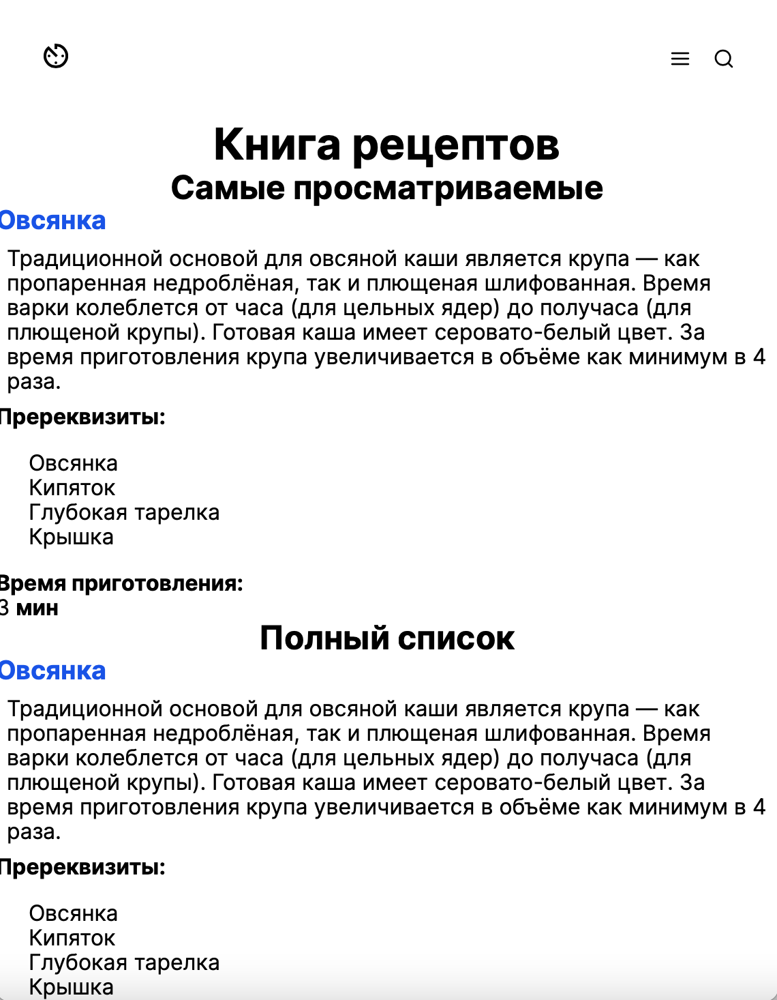
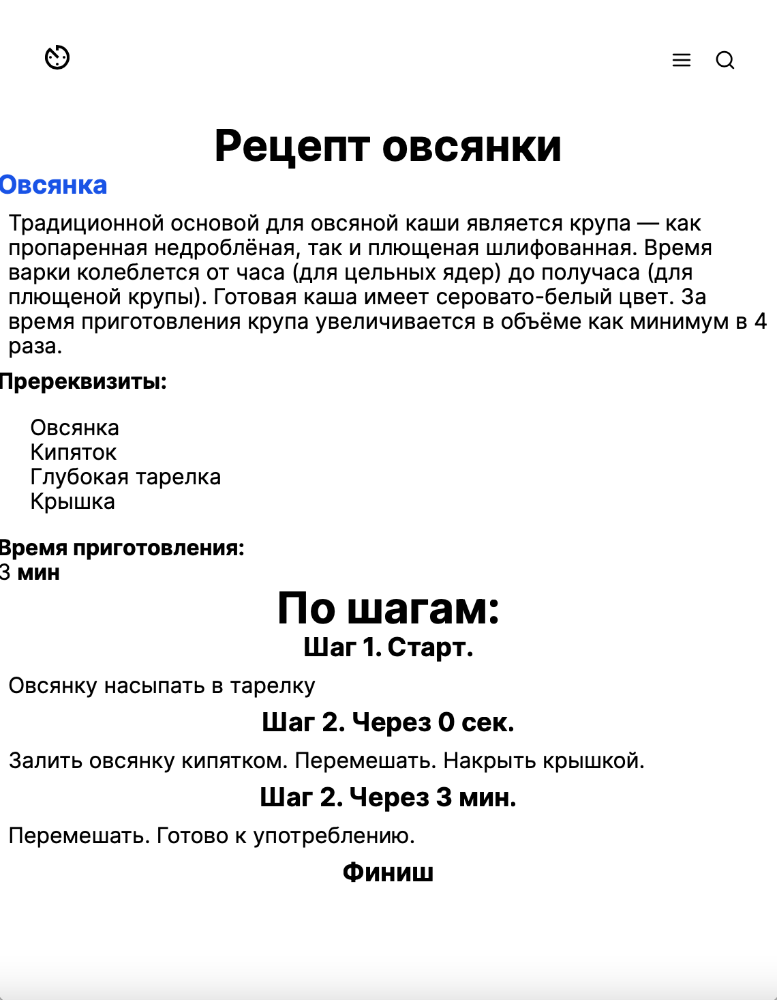
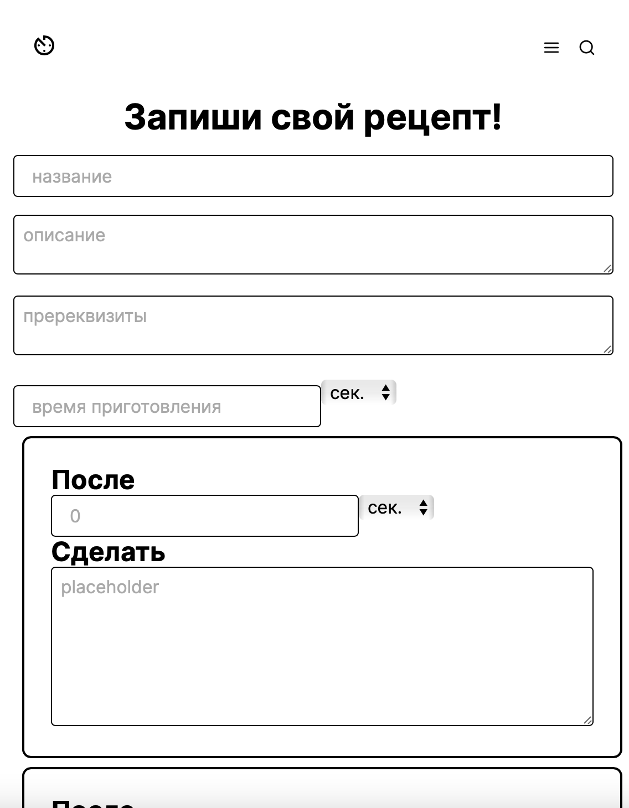

# Recipe (OTUS Homework)
Учебный проект курса kotlin backend developer. Recipe - это площадка на которой
пользователи создают свои рецепты (что делать, когда), могут найти уже готовые и поделиться своими.

## Маркетинг приложения
Считаем, что целевая аудитория данного приложения это любители поесть и приготовить любого достатка.
1. Найти готовый рецепт, чтобы овладеть какой-либо новой для себя техникой (приготовить плов)
1. Вести собственный дневник событий с отметками по времени (записать свой рецепт).
1. Поделиться своим уникальным подходом (маринуем в кефире, через 5 минут добавляем перец, через два часа минералку) с широкой аудиторией.

### Гипотетический портрет пользователя для поиска рецепта
1. Мужчина или женщина старше 18
2. Сам/а себя обеспечивает
3. Любит поесть и не боится экспериментов в еде

### Гипотетический портрет пользователя для создания рецепта
1. Любой повар старше 30
2. Обладаем уникальными знаниями или достижениями в одной из областей
3. Часто испытывает сложности при взаимойдействии с техникой и интернетом

## Описание MVP
### Главная страница


### Страница просмотра рецепта


### Страница создания рецепта


[Mock app](https://outlandish-other-penguin-w258b2.teleporthq.app)

### Функции (endpoints)

1. CRUDS (create, read, update, delete, search) для рецептов (recipe)

### Описание сущности recipe
1. Info
   1. Title
   2. Description
   3. Requirements (list of requirement)
      1. requirement
   4. Duration
      1. duration
      2. time unit
   5. Owner
   6. Visibility
2. Steps (list ot step)
    1. Step
       1. Hold
          1. duration
          2. time unit
       2. Description
   
## Структура проекта
### Транспортные модели, API
1. [specs](specs) - описание API в форме OpenAPI-спецификаций
2. [recipe-api-v1](recipe-api-v1) - генерация первой версии транспортных моделей для KMP
3. [recipe-common](recipe-common) - модуль с общими классами для модулей проекта. Тут также внутренние модели и контекст
4. [recipe-mappers-v1](recipe-mappers-v1) - мапперы между recipe-api-v1 и внутренними моделями в recipe-common
5. [recipe-stubs](recipe-stubs) - модуль со стабами для тестирования
5. [recipe-services](recipe-services) - модуль для бизнес логики
5. [recipe-app-ktor](recipe-app-ktor) - приложение с использованием фреймворка Ktor
5. [recipe-biz](recipe-biz) - модуль с описанием бизнес логики на COR
5. [chain-of-responsibility](chain-of-responsibility) - реализация chain of responsibility
5. [recipe-app-kafka](recipe-app-kafka) - приложение для работы с kafka

## Docker
### Запустить kafka
```
docker-compose -f dockers/docker-compose-kafka.yaml up -d
```

### Остановить kafka
```
docker-compose -f dockers/docker-compose-kafka.yaml down
```